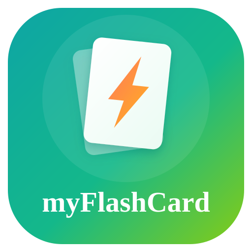

<div align="center">
  
  <h1>myFlashCard</h1>
  <p><strong>Offline flash-card viewer for Android</strong></p>
  <p>Load any JSON card deck — training plans, recipes, study notes — and flip through it on your phone, no internet required.</p>

  <a href="https://play.google.com/store/apps/details?id=com.willygo.myflashcard">
    
  </a>
  
  
</div>

---

## ✨ Features

- 📂 **Load any card deck** — pick a JSON file from your phone's storage
- 🃏 **Swipe or tap** to navigate between cards
- 🎨 **Rich card blocks** — tables, numbered steps, stats tiles, notes, images
- 🌈 **Per-deck colour themes** — each deck can have its own accent colours
- 📴 **Fully offline** — no internet, no account, no tracking

---

## 🚀 How to Use

### Step 1 — Create a card deck with an AI tool

Open [Claude](https://claude.ai), [ChatGPT](https://chat.openai.com) or any AI assistant and ask it to generate a card deck in the myFlashCard JSON format.

**Example prompt:**
> *"Create a myFlashCard JSON deck for a 4-week beginner running plan. Use table blocks for each week's sessions and a note block at the top with the goal."*

The AI will produce a JSON file following this structure:

```json
{
  "deckTitle": "My Card Deck",
  "accentColor": "#A6543C",
  "cards": [
    {
      "title": "Card Title",
      "subtitle": "Optional subtitle",
      "blocks": [
        {
          "type": "note",
          "text": "A highlighted note or goal.",
          "accentColor": "#7A2E3A"
        },
        {
          "type": "table",
          "heading": "Session plan",
          "accentColor": "#3E7CB1",
          "columns": ["#", "Exercise"],
          "rows": [
            ["1", "Warm up 5 min"],
            ["2", "Run 20 min easy pace"],
            ["3", "Cool down 5 min"]
          ]
        },
        {
          "type": "steps",
          "heading": "Tips",
          "style": "bullet",
          "items": ["Stay hydrated", "Keep a steady pace", "Stretch after"]
        }
      ]
    }
  ]
}
```

**Supported block types:**

| Type | Description |
|------|-------------|
| `note` | Bold centred text — goals, warnings, tips |
| `stats` | Row of stat tiles (e.g. Prep time · Serves · Calories) |
| `table` | Table with coloured header and striped rows |
| `steps` | Numbered or bulleted list |
| `text` | Plain paragraph |
| `image` | Placeholder (local files not yet supported) |

---

### Step 2 — Save the JSON file to your phone

Once the AI produces the JSON:

1. Copy the JSON text
2. Save it as a `.json` file (e.g. `running-plan.json`)
3. Transfer it to your phone — via **OneDrive**, **Google Drive**, **WhatsApp**, **email**, or USB cable into the **Downloads** folder

---

### Step 3 — Load the deck in the app

1. Open **myFlashCard** on your phone
2. Tap **"Load card file"**
3. Browse to your `.json` file and select it
4. Swipe left/right or use the **Prev / Next** buttons to navigate

That's it — your deck loads instantly, no account needed.

---

## 🔒 Privacy Policy

**Last updated: September 2025**
**Developer: WillYGO Incorporation**

### What data we collect

**None.** myFlashCard does not collect, store, transmit, or share any personal data whatsoever.

### How the app works

- All card decks are JSON files that **you create and load yourself** from your own device storage.
- The app reads the file you select and displays it on screen.
- **No data leaves your device.** The app makes no network requests of any kind.
- Nothing is stored on external servers — there are no servers.

### Permissions

| Permission | Why |
|---|---|
| **Storage / Files** | To let you pick a JSON card file from your phone using the system file picker |

No other permissions are requested or used.

### Third-party services

This app uses no analytics, no advertising SDKs, no crash-reporting tools, and no third-party services of any kind.

### Children's privacy

Because no data is collected, the app is safe for users of all ages.

### Changes to this policy

If we ever add features that affect data handling, this policy will be updated and the "Last updated" date will change.

### Contact

Questions? Email us at **support@willygo.com**

---

## 🛠 Building from source

```bash
git clone https://github.com/WillYGO/myFlashCard.git
cd myFlashCard
./gradlew assembleDebug
```

Requires Android Studio Meerkat or later, Android SDK 37.

---

<div align="center">
  <sub>Made with ❤️ by <a href="https://willygo.com">WillYGO Incorporation</a> · Hong Kong</sub>
</div>
